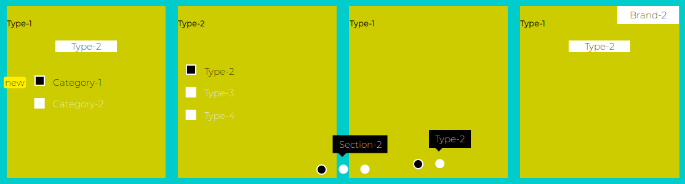

<p align="center">
	<a  href="http://somacss.ir"></a>
</p>


<h2 align="center">Description</h2>

Soma CSS is a small, functional and pure CSS3 library which offers CSS components that are:
 + Immutable like Pure Functions in FP approach
 + Reusable like Objects in OOP approach
 + Nestable like Components in React approach
 
Components can be created:  
 + manually using simple editors or emmet plugin
 + or using JavaScript  
 
But, For their actions they do not need JavaScript.

<h2 align="center">Prerequisites</h2>

<h4>CSS Part</h4>
The CSS part is heavily base on 

  - flex-box
  - input's UI-State pseudo-class (= :checked)
  - label's [for] attribute
  - transform: translate

<h4>JavaScript Part</h4>
The JS part uses Pure JS DOM APi provided by browsers like

  - document.createElement
  - element.[get|set]Attribute
  - element.appendChild( Node )
  - etc

<h4>React Part</h4>
The React is base on:

  - react 16+
  - react-dom
  - JSX


<h2 align="center">How to Use</h2>

You can use them in either way of Pure CSS or creating them using JS and then using them.
Actually API has been divided in to three types:  

<h4>Using Pure CSS (= <a href="http://somacss.ir">somacss.ir</a>)</h4>
JavaScript is used for creating the components but CSS manages the state.

CSS file:
```CSS
<link rel="stylesheet" type="text/css" href="soma.prefixed.min.css" />
```


JS in ES6 format:  

```js
import { carouselZ, carouselY, carouselX, slickX, progressX } from 'somacss';
```

JS in ES5 format using Global `S`  

```html
<script type="application/javascript" src="soma.es5.js"></script>
// Global S.xxx are available to use
// S.carouselZ
// S.carouselY
// S.carouselX
// and so on
```

<h4>Using JavaScript (= <a href="http://somajs.ir">somajs.ir</a>)</h4>
JavaScript is used for both creating the and managing the state.

<h4>Using React (= <a href="http://somareact.ir">somareact.ir</a>)</h4>
React (JSX) is used for both creating the and managing the state.

<h2 align="center">Download</h2>

<h4>Just Source</h4>

```
# Soma CSS
git clone https://github.com/k-five/soma

# Soma JS


# Soma React

```
If you want to build it from source, install:

 - sass && jest globally
 - And devDependencies on package.json file
 
There is no `__tests__` directory, so for running test just try:

```bash
jest src/
# or
jest --max-workers 2 src/
```


<h4>Just Last Release</h4>

```
# Soma CSS
npm install somacss     # install the package
cd node_modules/somacss # package root
cd build                # release file are here
tree --dirsfirst -sh
.
├── [4.0K]  css
│   ├── [ 47K]  soma.css              # raw version
│   ├── [ 23K]  soma.css.map
│   ├── [ 40K]  soma.min.css          # minified version
│   ├── [ 23K]  soma.min.css.map
│   ├── [ 50K]  soma.prefixed.css     # prefixed version
│   ├── [ 15K]  soma.prefixed.css.map
│   └── [ 42K]  soma.prefixed.min.css # prefixed + minified
└── [4.0K]  js
    ├── [ 11K]  soma.es5.js           # is used with <script src> which has global S
    └── [ 11K]  soma.js               # import { name-of-the-component } from 'somacss'

# Soma JS


# Soma React

```

<h4></h4>
<h4></h4>


<h2 align="center">Example</h2>
<h4>Combining 5 components to build a super carousel</h4>

 - CarouselZ (managing Brands)
 - CarouselY (managing Categories)
 - CarouselX (managing Sections)
 - SlickX    (managing Products)
 - Carousel(Z or Y or X) (managing Types)  
 

<h4>The Code for final part of the challenge on <a href="http://somacss.ir/">somacss.ir</a></h4>

```js
// eCommerce is a JSON file
// var keys = Object.keys
brands = keys( eCommerce );
var final = carouselZ({
    titles: brands,
    children: brands.map( function( brand ){

        // array of categories for each brand
        var categories = keys( eCommerce[ brand ] );

        // and for each brand creating carousel-y
        return carouselY({
            titles: categories,
            children: categories.map( function( category ){

                // array of sections for each category
                var sections = keys( eCommerce[ brand ][ category ] );

                // and for each category creating carousel-x
                return carouselX({
                    titles: sections,
                    children: sections.map( function( section ){

                        // if we have any products
                        var products = keys( eCommerce[ brand ][ category ][ section ] );

                        // one slide for each product
                        return slickX({
                            children: products.map( function( product, productIndex ){

                                // when we have types of products
                                var types = keys( eCommerce[ brand ][ category ][ section ][ product ] );

								// just playing with combination of carousel(Z or Y or X)
                                switch( types.length ){
                                    case 0:
                                        return h1( "dummy content " + productIndex ).cloneNode( true );
									break;

                                    case 2:
                                    return carouselX({
                                        titles: types,
                                        children: types.map( function( typeName ){
                                            return h1( typeName ).cloneNode( true );
                                        })
                                    });
									break;

                                    case 3:
                                    return carouselY({
                                        titles: types,
                                        children: types.map( function( typeName ){
                                            return h1( typeName ).cloneNode( true );
                                        })
                                    });
									break;

                                    default:
                                    return carouselZ({
                                        titles: types,
                                        children: types.map( function( typeName ){
                                            return h1( typeName ).cloneNode( true );
                                        })
                                    });
                                } // end of switch()
                            })
                        });
                    })
                });
            })
        });
    })
});
```

<h4>the structure</h4>

```bash
carouselZ
├── titles
└── children
    └── carouselY
        ├── titles
        └── children
            └── carouselX
                ├── titles
                └── children
                    └── slickX
                        └── children
                            └── carouselZ
                                ├── titles
                                └── children


```

<h4>the output</h4>
 
 <p align="center">
	<a  href="http://somacss.ir/"></a>
</p>
 

<h2 align="center">Copyright & License</h2>
<p align="center">
	<a  href="https://github.com/k-five/soma/blob/master/LICENSE"></a>
</p>
